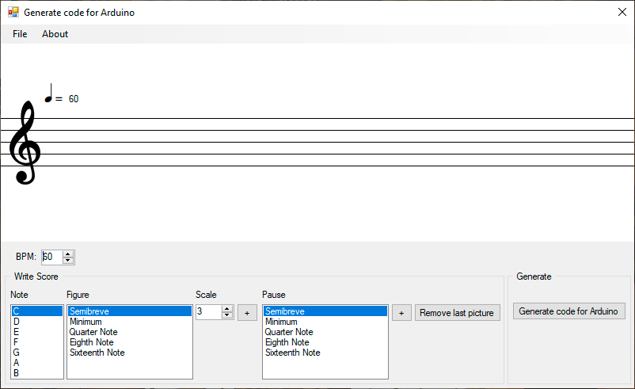
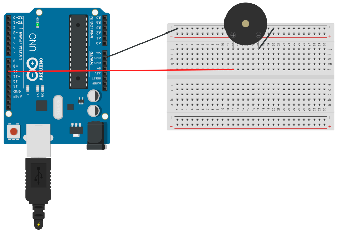

# Score Editor for Arduino

This project is used to write small scores and convert the written sounds into code to be used in an Arduino project with a buzzer.

## Download
To download the program just [click here](https://github.com/jeihcio/sheet-music-to-buzzer-from-arduino/releases) and download the zip file for the latest version

## Sheet music editor

## Project on Arduino

Below is a basic example of an Arduino project with a buzzer

### Online Simulator

If you want to test the project in an online simulator you can use Tinkercad. Here is a link to a base project to test [View project](https://www.tinkercad.com/things/0m69whJNaFS-buzzer-test)

## References

The Arduino code generated by the score converter was based on the ["Arduino Songs"](https://github.com/robsoncouto/arduino-songs/) projects. In this project you can find several examples of ready-made songs. If you want a more technical explanation about how the conversion of the score to the buzzer is done, you can find it in the following article by the author of "arduino-songs", by [clicking here](https://dragaosemchama.com/2019/04/musicas-para-arduino-a-partir-da-partitura/).
